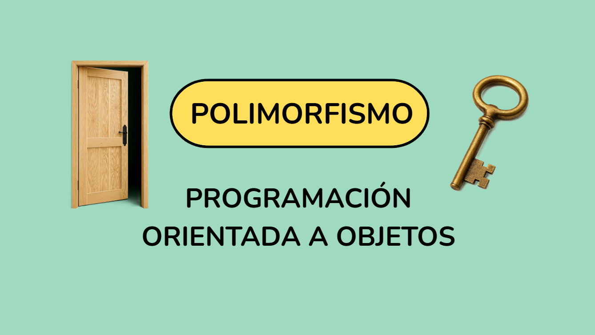
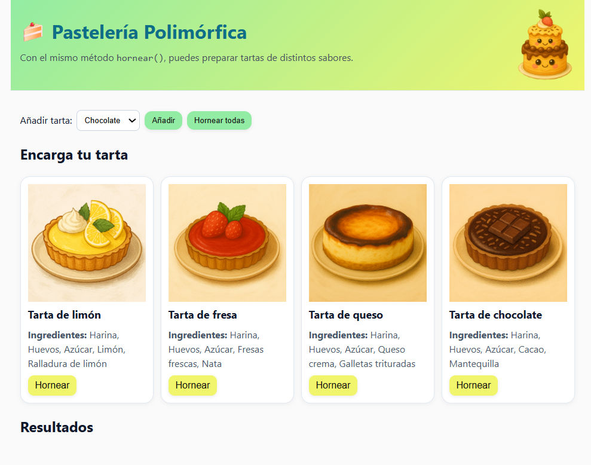

# Pastelería Polimórfica en TypeScript

## 🍰 Descripción de la píldora

Esta pildora formativa tiene como objetivo enseñar **polimorfismo y herencia en TypeScript** mediante una presentación explicativa y un ejemplo práctico: 
la creación de diferentes tartas. Cada clase de tarta tiene sus **ingredientes específicos** y su propia manera de **hornearse**, demostrando cómo un mismo método (`hornear()`) puede comportarse diferente según la clase concreta.

La píldora incluye:

- Parte teórica sobre **clases abstractas, herencia y polimorfismo**.
- Parte práctica con **interacción en la web**, donde se pueden añadir tartas, hornearlas individualmente o todas a la vez.
- Material complementario en PDF para entender el código y su flujo.

### Píldora en línea

Puedes ver la presentación de la píldora clicando en el siguiente enlace:  

[Presentación Canva](https://nueva-presentacion.my.canva.site/polimorfismo-con-typescript)



---

## 📂 Estructura de carpetas del proyecto

```
PASTELERIA-POLIMORFICA/
├── node_modules/
├── public/
├── src/
│ ├── ejemplos/
│ │ └── codigo-explicado.ts
│ │ └── ingredientes-sin-herencia.ts
│ ├── main.ts
│ ├── style.css
│ ├── typescript.svg
│ └── vite-env.d.ts
├── assets/
│ ├── codigo-comentado.pdf
│ ├── esquema-flujo.pdf
│ ├── explicacion-codigo.pdf
│ └── flujo-completo-codigo.pdf
├── .gitignore
├── index.html
├── package-lock.json
├── package.json
└── tsconfig.json

````

---

## 📌 Material complementario

- [Código comentado](assets/codigo-comentado.pdf)  
- [Esquema del flujo](assets/esquema-flujo.pdf)  
- [Flujo completo del código](assets/flujo-completo-codigo.pdf)  
- [Explicación detallada del código](public/explicacion-codigo.pdf)  

### Captura de la web de la práctica



---

## ❓Cómo trabajar en el proyecto

### Fork y/o clonación

1. **Hacer fork** del repositorio en tu cuenta de GitHub:  
   - Esto crea una copia del repositorio original que puedes modificar libremente.
2. **Clonar** el repositorio a tu máquina local:  

```
Sigue estos pasos para tener el proyecto funcionando en tu ordenador:

1. Abre una terminal en la carpeta donde quieras guardar el proyecto y escribe:  

   git clone https://github.com/Aday25/pasteleria-polimorfica.git

2. Entrar en la carpeta del proyecto

cd pasteleria-polimorfica

3. Instalar dependencias
Este proyecto utiliza Node.js y Vite.
Instala todo lo necesario con:

npm install

4. Iniciar el servidor de desarrollo
Lanza la aplicación en modo local con:

npm run dev

Verás en consola una dirección (por ejemplo: http://localhost:5173/).
Abre esa URL en tu navegador para acceder a la aplicación. 🎂
```

🔹 Ahora podrás ver la web en el navegador y probar la pildora.

Nota: si solo clonas sin fork, puedes ver y ejecutar el proyecto, pero los cambios no podrán subirse a GitHub sin permisos sobre el repositorio original. Con fork, cada un@ tiene su propio repositorio y puede renombrarlo sin afectar el original.

---

✔️​ **Objetivos de aprendizaje**
- Entender qué es una clase abstracta y por qué se usa.

- Comprender polimorfismo y cómo se implementa en TypeScript.

- Saber cómo heredar propiedades y métodos y sobrescribirlos.

- Aprender a manipular el DOM con TypeScript y añadir interactividad.

- Practicar la organización de un proyecto real con HTML, CSS y TS.

---

**🔍​ Tecnologías utilizadas**

- TypeScript
- HTML y CSS
- Vite

---
 
> Esta práctica forma parte de las actividades del **Bootcamp Factoría F5 - Fem Coders 4 - 2025**.

<p align="center">
  
</p>
